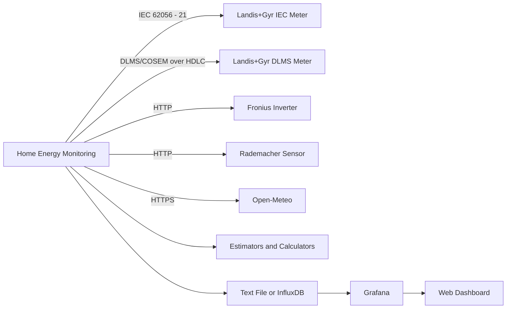

### Workflow Status

[](https://github.com/ksw1984/home-energy-monitoring/actions/workflows/ci.yml)

# Home Energy Monitoring

Home energy monitoring using Docker Compose. The application collects measurements from electricity meters, photovoltaic
inverters, environmental sensors, and weather services, then stores and visualizes the data through InfluxDB and
Grafana.

---

## Table of contents

- [Overview](#overview)
- [Supported collectors](#supported-collectors)
- [Architecture](#architecture)
- [Configuration](#configuration)
- [Storage configuration](#storage-configuration)
- [Estimators and calculators](#estimators-and-calculators)
- [Testing](#testing)
- [Pre-commit hooks](#pre-commit-hooks)
- [Docker commands](#docker-commands)
- [Deploy to Raspberry Pi](#deploy-to-raspberry-pi)
- [Release workflow](#release-workflow)
- [Troubleshooting](#troubleshooting)

---

## Overview

The application:

- Collects energy measurements from supported devices.
- Supports both IEC and DLMS/COSEM communication with Landis+Gyr ZMD310 meters.
- Collects photovoltaic measurements from Fronius inverters.
- Collects environmental measurements from Rademacher sensors.
- Collects weather data from Open-Meteo.
- Calculates derived measurements such as heat-pump power and inverter efficiency.
- Stores selected measurements in JSON Lines files or InfluxDB.
- Provides Docker Compose deployment for local systems and Raspberry Pi devices.
- Publishes multi-platform container images to GitHub Container Registry.

Important repository files:

- Application configuration: `config.yaml`
- Docker Compose deployment: `deployment/compose.yml`
- Example environment file: `deployment/.env.example`
- Docker files: `docker/`
- Tests: `test/`
- Grafana provisioning and dashboards: `grafana/`
- Pre-commit configuration: `.pre-commit-config.yaml`

---

## Supported collectors

### Landis+Gyr ZMD310 DLMS/COSEM meter

The DLMS collector communicates with Landis+Gyr ZMD310 meters using the DLMS/COSEM protocol over a serial connection.

The connection performs:

1. IEC 62056-21 identification.
2. Baud-rate negotiation.
3. HDLC SNRM/UA negotiation.
4. DLMS AARQ/AARE association.
5. Register reads using configured OBIS definitions.
6. Scaler handling for meter values.

DLMS supports faster polling intervals, such as one second, when supported by the meter and serial hardware.

Example:

```yaml
- type: landys_gyr_zmd310_meter_dlms
  enabled: true
  interval: 1
  attributes:
    port: /dev/ttyUSB0
    source: meter_grid_dlms
```

### Landis+Gyr ZMD310 IEC meter

The IEC collector communicates with the same meter family using IEC 62056-21.

IEC polling is slower than DLMS and should use a suitable interval for the meter and serial interface.

Example:

```yaml
- type: landys_gyr_zmd310_meter_iec
  enabled: false
  interval: 10
  attributes:
    port: /dev/ttyUSB0
    source: meter_grid_iec
```

### Fronius inverter

The Fronius collector supports:

- PV power from the Fronius REST API.
- Daily, yearly, and total PV energy.
- AC inverter power and total AC energy through SunSpec/Modbus.
- MPPT 1 and MPPT 2 power and energy measurements.

Example:

```yaml
- type: fronius
  enabled: true
  interval: 10
  attributes:
    source: inverter_fronius
    inverter_ip: 192.168.178.25
    latitude: 52.4
    longitude: 13.7
```

### Rademacher environment sensor

Example:

```yaml
- type: environment
  enabled: true
  interval: 60
  attributes:
    source: sensor_rademacher
    smart_home_box_ip: 192.168.178.19
    device_id: 50
```

### Open-Meteo weather service

Example:

```yaml
- type: weather
  enabled: false
  interval: 3600
  attributes:
    source: online_open_meteo
    latitude: 52.4
    longitude: 13.7
```

---

## Architecture



Collectors run independently and can use different collection intervals. For example:

- DLMS meter: every 1 second.
- Fronius inverter: every 10 seconds.
- Rademacher sensor: every 60 seconds.
- Open-Meteo: every 3600 seconds.

---

## Configuration

The main configuration file is `config.yaml`.

### Collection timezone

All measurement timestamps use the configured timezone:

```yaml
collection:
  timezone: Europe/Berlin
```

### Collector configuration

Each collector supports:

- `type`: Collector implementation.
- `enabled`: Enables or disables the collector.
- `interval`: Collection interval in seconds.
- `attributes.source`: Source name attached to generated measurements.
- Additional device-specific attributes.

Example:

```yaml
collectors:
  - type: landys_gyr_zmd310_meter_dlms
    enabled: true
    interval: 1
    attributes:
      port: /dev/ttyUSB0
      source: meter_grid_dlms

  - type: landys_gyr_zmd310_meter_dlms
    enabled: true
    interval: 1
    attributes:
      port: /dev/ttyUSB1
      source: meter_household_dlms

  - type: fronius
    enabled: true
    interval: 10
    attributes:
      source: inverter_fronius
      inverter_ip: 192.168.178.25
      latitude: 52.4
      longitude: 13.7
```

Disabled collectors remain available in the configuration but do not open connections or collect measurements.

---

## Storage configuration

Storage configuration controls which measurements are persisted.

```yaml
storage:
  measurements:
    meter_grid:
      - grid_import_energy_total
      - grid_export_energy_total
      - grid_active_power

    meter_household:
      - grid_import_energy_total
      - grid_export_energy_total
      - grid_active_power

    inverter_fronius:
      - pv_power
      - pv_energy_day
      - pv_energy_year
      - pv_energy_total
      - ac_energy_total
      - mppt_1_energy_total
      - mppt_2_energy_total

    calculated:
      - inverter_efficiency
      - heat_pump_power
```

Measurements are identified by:

- Source.
- Metric.
- Measurement type.

For example:

```text
meter_grid + grid_active_power + current
```

### Text-file database

The text-file database stores measurements as JSON Lines files, one file per day:

```yaml
databases:
  - type: text_file
    enabled: true
    attributes:
      directory: ./data/backup
```

Example output file:

```text
data/backup/2026-09-21.jsonl
```

### InfluxDB database

InfluxDB can be enabled as an additional database:

```yaml
databases:
  - type: influxdb
    enabled: true
    attributes:
      url: http://influxdb:8086
      org: home-energy
      bucket: energy
```

The InfluxDB token is read from the environment.

---

## Estimators and calculators

Calculators produce derived measurements from collected or estimated values.

### Kalman estimator

A Kalman estimator can smooth measurements and provide a value at a selected lookback position:

```yaml
estimators:
  - type: kalman
    enabled: true
    lookback: 2
```

The estimator is automatically created for measurements required by multi-source calculations.

### Formula calculator

Formula calculators combine measurement values using named inputs.

```yaml
calculators:
  - type: formula
    enabled: true
    calculations:
      - source: calculated
        metric: heat_pump_power
        unit: kW
        formula: "grid_power - household_power"

        inputs:
          grid_power:
            source: meter_grid
            metric: grid_active_power

          household_power:
            source: meter_household
            metric: grid_active_power
```

This calculation estimates household consumption that is not represented by the household meter:

```text
heat_pump_power = grid_active_power - household_active_power
```

### Inverter efficiency calculation

The inverter efficiency calculation combines AC output power with the DC power from both MPPT inputs:

```yaml
- source: calculated
  metric: inverter_efficiency
  unit: "%"
  formula: "ac / (dc1 + dc2) * 100"

  inputs:
    ac:
      source: inverter_fronius
      metric: ac_power

    dc1:
      source: inverter_fronius
      metric: mppt_1_power

    dc2:
      source: inverter_fronius
      metric: mppt_2_power
```

If the DC power is zero, the calculation is skipped instead of raising a division-by-zero error.

### Calculator processing

The measurement manager:

1. Receives measurements from collectors.
2. Keeps the latest value for each source and metric.
3. Adds measurements to enabled estimators.
4. Aligns inputs from different sources by timestamp.
5. Runs configured formulas.
6. Stores both raw and calculated measurements according to the storage configuration.

---

## Testing

### Run tests locally

```bash
pytest -q
```

### Pre-commit hooks

This repo already includes `.pre-commit-config.yaml` at the repository root. To install and use:

```bash
pip install pre-commit
pre-commit install
pre-commit run --all-files
```

The config includes ruff, black, mypy and basic sanity hooks.


### CI checks

The CI workflow runs:

- Ruff linting.
- Ruff formatting checks.
- Pyrefly type checking.
- Pytest.
- Coverage reporting.

---

## Integration testing on Raspberry Pi

Build an ARM64 image:

```bash
docker buildx build \
  --platform linux/arm64 \
  -t home-energy-monitoring:arm64 \
  -f ./docker/app/Dockerfile \
  --load .
```

Verify the architecture:

```bash
docker image inspect home-energy-monitoring:arm64 \
  --format '{{.Os}}/{{.Architecture}}'
```

Export the image:

```bash
docker save home-energy-monitoring:arm64 \
  -o home-energy-monitoring-arm64.tar
```

Copy the archive to the Raspberry Pi and load it:

```bash
docker load \
  -i /opt/home-energy-monitoring/home-energy-monitoring-arm64.tar
```

Use a development Compose override:

```yaml
services:
  home-energy-monitoring:
    image: home-energy-monitoring:arm64
    restart: "no"
```

Run the development container:

```bash
docker compose \
  -f deployment/compose.yml \
  -f docker-compose.dev.yml \
  run \
  --name home-energy-monitoring-dev \
  --no-deps \
  home-energy-monitoring
```

For DLMS or IEC meter access, ensure the required serial devices are passed through in `deployment/compose.yml`:

```yaml
services:
  home-energy-monitoring:
    devices:
      - /dev/ttyUSB0:/dev/ttyUSB0
      - /dev/ttyUSB1:/dev/ttyUSB1
```

---

## Docker commands

Run commands from the repository root.

Pull images:

```bash
docker compose \
  -f deployment/compose.yml \
  --env-file .env \
  pull
```

Start services:

```bash
docker compose \
  -f deployment/compose.yml \
  --env-file .env \
  up -d
```

Stop services:

```bash
docker compose \
  -f deployment/compose.yml \
  --env-file .env \
  down
```

Check service status:

```bash
docker compose \
  -f deployment/compose.yml \
  --env-file .env \
  ps
```

View application logs:

```bash
docker compose \
  -f deployment/compose.yml \
  --env-file .env \
  logs -f home-energy-monitoring
```

Use container logs directly:

```bash
docker logs <container-name>
docker logs --tail 100 <container-name>
```

---

## Deploy to Raspberry Pi

Install Docker:

```bash
curl -fsSL https://get.docker.com -o get-docker.sh
sh get-docker.sh
```

Create a `.env` file in the repository root. Example:

```dotenv
HOME_ENERGY_VERSION=0.9.0
INFLUXDB_VERSION=2.9.1
GRAFANA_VERSION=13.2

INFLUXDB_URL=http://influxdb:8086
INFLUXDB_ORG=home-energy
INFLUXDB_BUCKET=energy
INFLUXDB_TOKEN=CHANGE_ME

GF_SECURITY_ADMIN_USER=admin
GF_SECURITY_ADMIN_PASSWORD=CHANGE_ME
```

Start the deployment:

```bash
docker compose \
  -f deployment/compose.yml \
  --env-file .env \
  pull

docker compose \
  -f deployment/compose.yml \
  --env-file .env \
  up -d
```

Check the logs:

```bash
docker compose \
  -f deployment/compose.yml \
  --env-file .env \
  logs -f home-energy-monitoring
```

---

## Release workflow

The release process is:

1. Update the version in `pyproject.toml`.
2. Add the release entry to `CHANGELOG.md`.
3. Create a pull request to merge changes into `dev`.
4. The release workflow validates the version and changelog.
5. A release pull request is created from `dev` to `main`.
6. Merge the release pull request manually.
7. The release workflow:
    - Creates the Git tag.
    - Builds the Python package.
    - Creates the GitHub Release.
    - Builds and publishes multi-platform container images to GHCR.

---

## Troubleshooting

### DLMS connection problems

Check:

- The serial device exists:

  ```bash
  ls -l /dev/ttyUSB*
  ```

- The container has access to the serial device.
- The configured port matches the meter.
- The meter supports DLMS/COSEM communication.
- The configured collector source is unique.
- The DLMS collector is enabled.
- The collection interval is appropriate for the meter.

### IEC connection problems

IEC communication is slower than DLMS. Check:

- The configured interval is not too short.
- The serial device is not used by another process.
- The meter responds to IEC identification.
- The serial device permissions are correct.

### Missing calculated measurements

Check:

- The calculator is enabled.
- The input source and metric names match the collector configuration.
- The required input measurements are enabled for collection.
- The calculated metric is included in `storage.measurements`.
- The estimator has enough measurements available for its configured `lookback`.

### InfluxDB or Grafana problems

Check:

- `.env` exists in the repository root.
- InfluxDB and Grafana credentials are set.
- The deployment healthcheck is passing.
- The mounted data directories have the correct permissions.
- Service logs:

  ```bash
  docker compose \
    -f deployment/compose.yml \
    --env-file .env \
    logs influxdb grafana
  ```

Do not commit secrets in `.env`. Use deployment secrets or environment-specific configuration for production.
