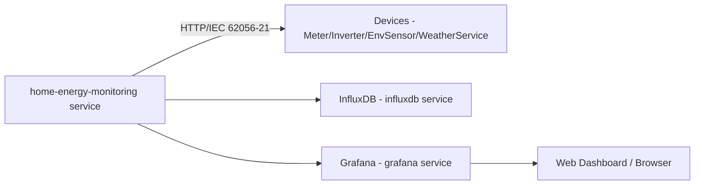

### Workflow Status

# Home Energy Monitoring

Short description
This repository runs the Home Energy Monitoring application using Docker Compose. This README references the actual configuration and deployment files present in this repo.

---

## Table of contents

- Overview
- Architecture
- Local tests & CI tests
- Pre-commit hooks
- Release workflow & build container
- Configuration (config.yaml and .env)
- Docker commands (pull, up, down, logs)
- Deploy to Raspberry Pi 4
- Troubleshooting & tips

---

## Overview

What this repo does
- Collects energy usage from sensors and forwards data to a backend and a dashboard.
- Packaged using Docker Compose for easy local development and production deployments.
- Configuration lives in repo files (see below) and image is published to GHCR.

Quick pointers to repo files
- Application configuration: `config.yaml` (root)
- Docker Compose: `deployment/compose.yml`
- Pre-commit config: `.pre-commit-config.yaml`
- Grafana provisioning & dashboards (used by the compose file): `grafana/provisioning` and `grafana/dashboards`
- Tests: `test/`
- Docker-related files: `docker/`

---

## Architecture

High-level architecture (uses services from `deployment/compose.yml`)

---

## Local tests & CI tests

Run tests locally
- There is a `test/` directory in the repo. Run your test suite (example):
  - pytest -q
- Alternatively run tests inside containers if you have a container configured for tests.

CI
- CI workflows in this repo build and test the project in CI (see `.github/workflows/` if present).
- Common CI steps your project uses or should use:
  - Check out repo
  - Build container image (or test container)
  - Run unit tests (from `test/`)
  - On tag: build & push multi-arch images to GHCR (image name in compose: `ghcr.io/ksw1984/home-energy-monitoring:${HOME_ENERGY_VERSION}`)

---

## Pre-commit hooks

This repo already includes `.pre-commit-config.yaml` at the repository root. To install and use:
- pip install pre-commit
- pre-commit install
- Run checks locally:
  - pre-commit run --all-files

The config includes ruff, black, mypy and basic sanity hooks.

---

## Release workflow & build container

Image referenced in compose
- Compose references: `ghcr.io/ksw1984/home-energy-monitoring:${HOME_ENERGY_VERSION}` in `deployment/compose.yml`.

Recommended flow
- Increase version in pyproject.toml and add a version to CHANGELOG.md (required)
- Create a PR to merge to dev.
- After merge to dev a workflow will check if the requirements are matched for a new release (higher version than tags)
- If requirements are met, a PR will be created to merge to main
- Manually merge this dev-to-main PR
- After the PR workflows will create release and build a docker container with this version

---

## Configuration

Files and paths in this repo
- Main app config: `config.yaml` (repo root) — used by the application. Example keys (already in your file): `collection.interval`, `collectors`, `databases`.
- Docker Compose environment:
  - The Compose file is `deployment/compose.yml`.
  - Compose references an env file; run compose commands from the repository root with `--env-file .env` (see below).
  - Note: `deployment/compose.yml` itself contains an `env_file: ../.env` mapping for services (so the runtime expects `.env` at repo root). If `.env` is not tracked, create it from your secrets.

Example important bits from repo
- Compose image: line in `deployment/compose.yml`:
  - image: ghcr.io/ksw1984/home-energy-monitoring:${HOME_ENERGY_VERSION}
- Compose mounts and volumes:
  - `./data/backup:/data/backup`
  - `./data/influxdb:/var/lib/influxdb2`
  - `./data/grafana:/var/lib/grafana`
  - Grafana provisioning: `./grafana/provisioning:/etc/grafana/provisioning:ro`
  - Dashboards: `./grafana/dashboards:/var/lib/grafana/dashboards:ro`

Sensitive values
- Do not commit secrets in `.env`. Use CI secrets for registry credentials and deployment secrets for production.

---

## Docker commands

Run these from the repository root (this matches how the Compose file references `../.env`)

Pull images
- docker compose -f deployment/compose.yml --env-file .env pull

Start (background)
- docker compose -f deployment/compose.yml --env-file .env up -d

Stop & remove containers
- docker compose -f deployment/compose.yml --env-file .env down

Check status
- docker compose -f deployment/compose.yml --env-file .env ps

Service logs (example service name matches `deployment/compose.yml`)
- docker compose -f deployment/compose.yml --env-file .env logs home-energy-monitoring
Live logs:
- docker compose -f deployment/compose.yml --env-file .env logs -f home-energy-monitoring

Per-container logs (container names created by Compose)
- docker logs <container-name>
- Last 100 lines:
  - docker logs --tail 100 <container-name>

Tips
- If `.env` is missing, create `.env` in repo root. Compose will use `--env-file .env` and the file referenced inside `deployment/compose.yml` also expects `../.env`.
- Use `docker compose -f deployment/compose.yml --env-file .env down --volumes` carefully (removes volumes).

---

## Deploy to Raspberry Pi 4 (ARM)

What to check
- `deployment/compose.yml` uses image `ghcr.io/ksw1984/home-energy-monitoring`.

Pi setup quick steps
1. Install Docker on Pi: curl -fsSL https://get.docker.com -o get-docker.sh && sh get-docker.sh
2. Ensure `docker compose` plugin is available, or install docker-compose plugin
3. Ensure the .env file contains the desired versions, e.g.
   - \# Docker Container Versions
   - HOME_ENERGY_VERSION=0.3.0
   - GRAFANA_VERSION=13.2
   - INFLUXDB_VERSION=2.9.1
4. From the repo root on Pi:
   - docker compose -f deployment/compose.yml --env-file .env pull
   - docker compose -f deployment/compose.yml --env-file .env up -d
   - docker compose -f deployment/compose.yml --env-file .env ps
   - docker compose -f deployment/compose.yml --env-file .env logs -f home-energy-monitoring

---

## Troubleshooting & tips

- If InfluxDB or Grafana don't start, check `deployment/compose.yml` healthcheck and volumes.
- Logs: docker compose -f deployment/compose.yml --env-file .env logs -f home-energy-monitoring
- If `.env` missing, create from your environment variables; `deployment/compose.yml` expects env values like `HOME_ENERGY_VERSION`, `INFLUXDB_VERSION`, `GRAFANA_VERSION`.
